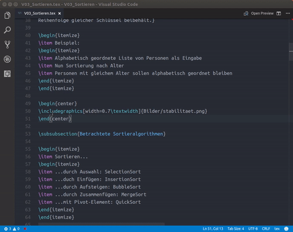

# latex-formatter README

LaTex-Formatter is a simple VisualStudio Code tool for the LaTex - Language

## Requirements

- Ubuntu
- latex-formatter requires [latexindent.pl](https://github.com/cmhughes/latexindent.pl) to be installed and to be in the path. 

## Release Notes

### 1.0.0

Initial release

## Roadmap

- Windows support
- Style options

